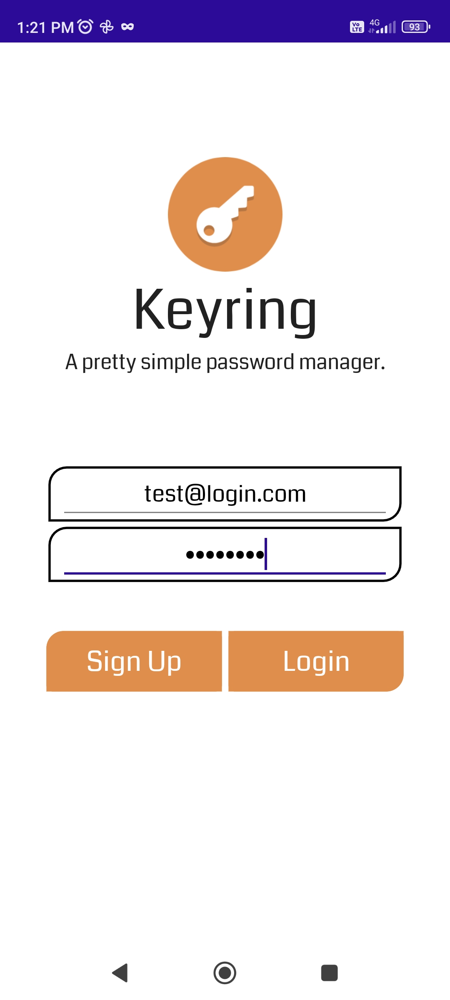
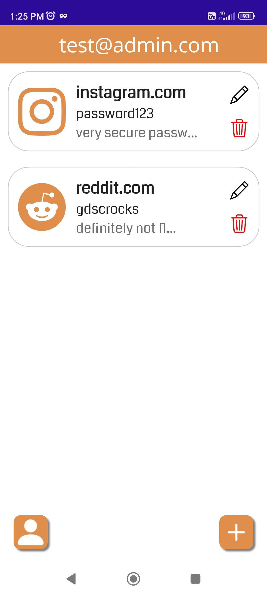
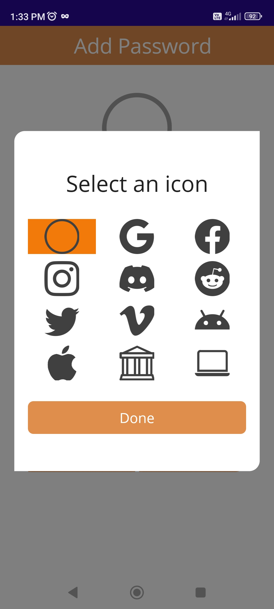
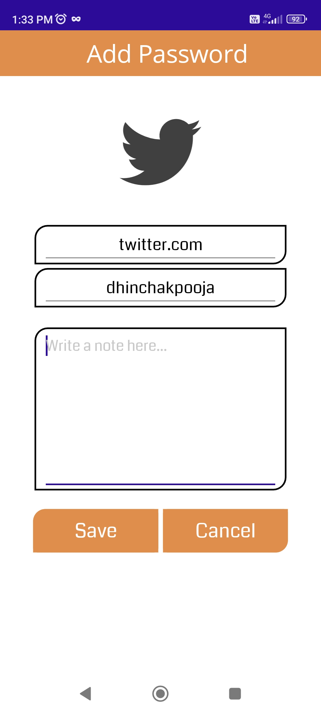
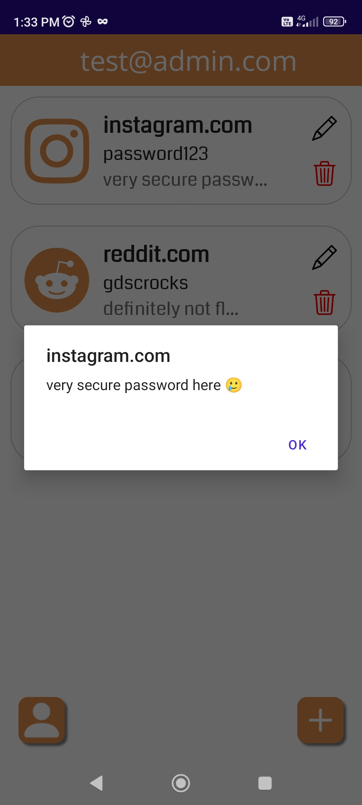
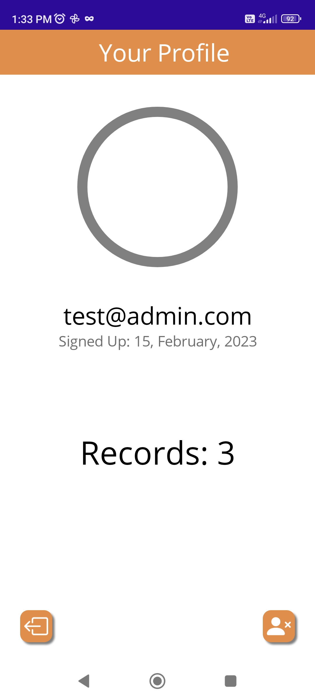
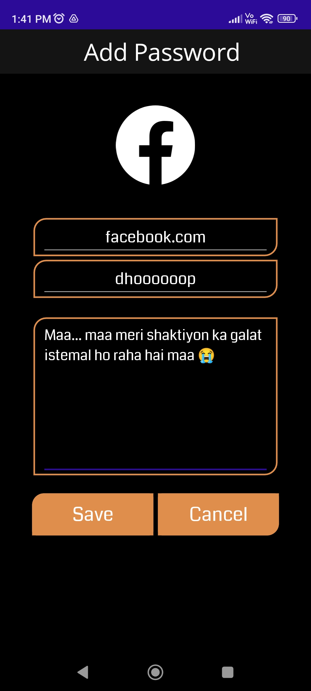
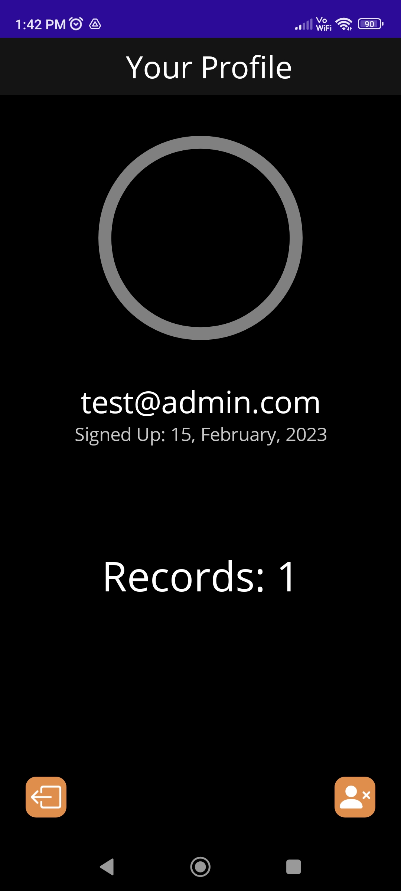

<a name="readme-top"></a>

<!-- PROJECT LOGO -->
<br />
<div align="center">
  <a href="https://github.com/DevChrome/Keyring">
    
  </a>
  
  <h3 align="center">Keyring: a super simple password manager</h3>

  <p align="center">
    A password manager built for GDSC using C#, .NET MAUI and SQLite. Has minimal "security". Wouldn't recommend using.
  </p>
</div>

<!-- TABLE OF CONTENTS -->
<details>
  <summary>Table of Contents</summary>
  <ol>
    <li>
      <a href="#about-the-project">About The Project</a>
    </li>
    <li>
      <a href="#running-from-source">Running From Source</a>
      <ul>
        <li><a href="#prerequisites">Prerequisites</a></li>
        <li><a href="#instructions">Instructions</a></li>
      </ul>
    </li>
    <li><a href="#screenshots">Screenshots</a></li>
    <li><a href="#license">License</a></li>
  </ol>
</details>


<!-- ABOUT THE PROJECT -->
## About The Project

A simple password manager made mostly with Android devices in mind, though it *should* work on iOS (completely untested).
<br><br>
It can create and manage multiple user accounts, each with multiple password records with icons and descriptions.
<br><br>
It has some "security" measures, i.e. weak password hashing, and an encrypted SQLite database (~~for which the passkey is definitely not as plaintext in the source~~).

<!-- GETTING STARTED -->
## Running From Source

To get this project running locally from source, follow these steps:

### Prerequisites

* .NET 7.0 SDK
* Visual Studio 2022 (+ .NET MAUI workload installed)

### Instructions

1. Clone the repository.
   ```sh
   git clone https://github.com/DevChrome/Keyring.git
   ```
2. Launch the solution in Visual Studio 2022.
3. Start an Android emulator and run the project.

<!-- USAGE EXAMPLES -->
## Screenshots









<!-- LICENSE -->
## License

Distributed under the MIT License. See `LICENSE.txt` for more information.


<p align="right">[<a href="#readme-top">Back To Top</a>]</p>
